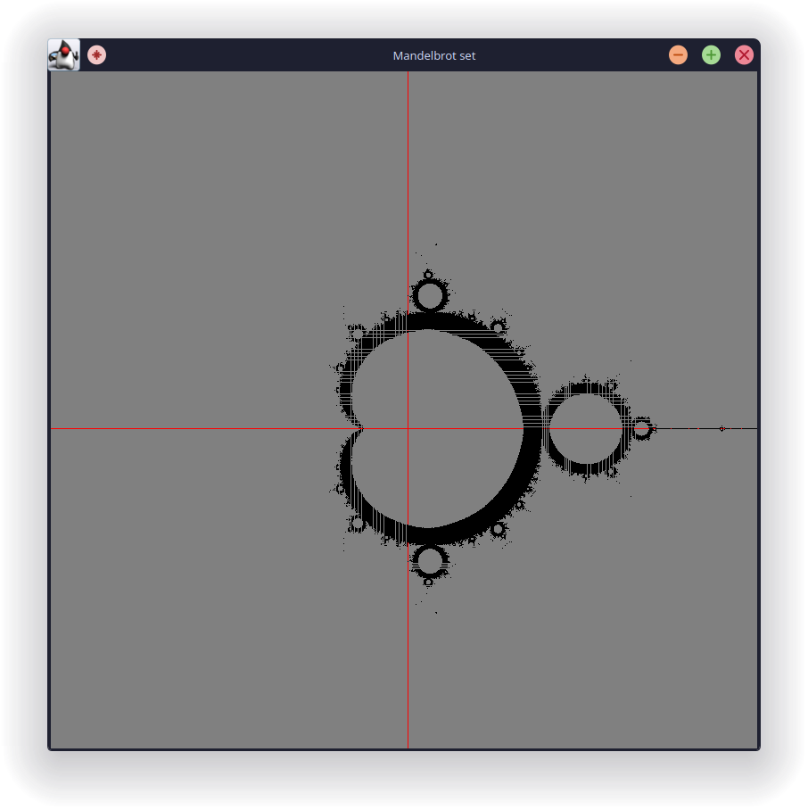

# Mandelbrot Set Visualizer

## Warning: This is buggy and extremely innefficient.<br/> 

<br/>
A software that can render the border of the Mandelbrot fractal and zoom to it (though it can generate up to 3 iterations)
<br/>

## Building
```
javac *.java
java App
```

## Prebuilt binaries
If for some reason, you don't want to build the code for yourself, there are precompiled binaries in the Releases page. You can launch the prebuilt jar file by running: 
```
java -jar mandelbrotVisualizer_x.x.jar
```

Of course, you have to replace x.x with the version you downloaded.

## Images

